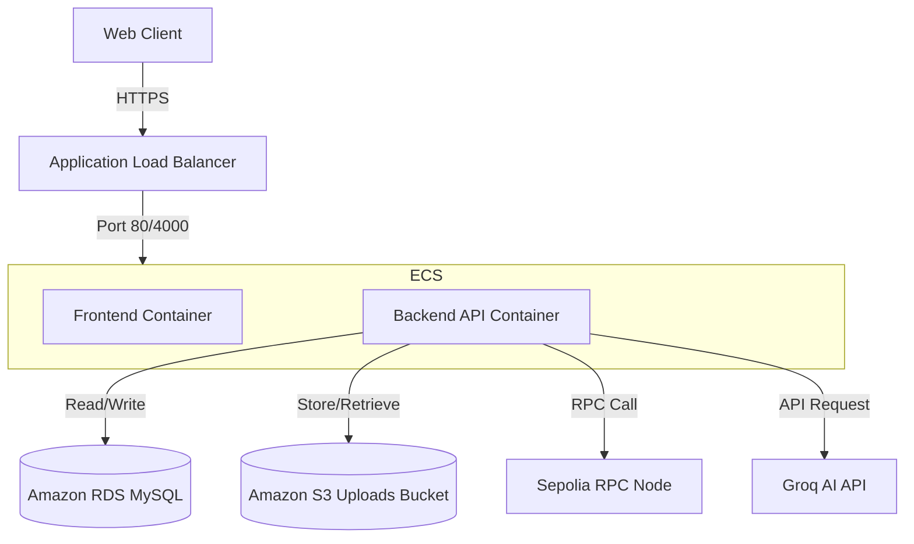

# MediVault — v2.0 Production Deployment & Pipeline Guide

This guide provides a comprehensive implementation plan to achieve **Dockerization**, **AWS Deployment**, and a **CI/CD Pipeline** for MediVault, adhering to the architecture and structural changes introduced in v1.0–v1.2.

---

## 1. Containerization (Fine Dockerization)

MediVault consists of three main components: a React (Vite) frontend, an Express 5 backend API, and a Python-based RAG service. The backend uses `child_process.spawn("python", ...)` to execute the RAG service query. Therefore, the backend Docker container **must** have both Node.js and Python 3 installed to support subprocess execution on the fast path.

### 1.1 Backend Dockerfile (Node.js + Python Subprocess Support)

Save this file as `apps/backend/Dockerfile`. It uses a Debian-based slim image to easily install python3, build dependencies (like `argon2` compilers if needed), and the Python dependencies.

```dockerfile
# apps/backend/Dockerfile
FROM node:20-bullseye-slim

# Install system dependencies, including Python 3, pip, and compilation tools
RUN apt-get update && apt-get install -y \
    python3 \
    python3-pip \
    python3-dev \
    build-essential \
    && rm -rf /var/lib/apt/lists/*

WORKDIR /app

# Copy package descriptors for npm
COPY apps/backend/package*.json ./apps/backend/
# Install Node dependencies (production only)
RUN npm ci --prefix apps/backend --omit=dev

# Copy requirements.txt for Python RAG service
COPY apps/rag-service/requirements.txt ./apps/rag-service/
# Install Python dependencies globally
RUN pip3 install --no-cache-dir -r apps/rag-service/requirements.txt

# Copy source code (maintaining the directory structure for relative imports)
COPY apps/backend/src/ ./apps/backend/src/
COPY apps/backend/scripts/ ./apps/backend/scripts/
COPY apps/backend/migrations/ ./apps/backend/migrations/
COPY apps/rag-service/ ./apps/rag-service/

# Set working directory to the backend application
WORKDIR /app/apps/backend

# Expose HTTP port
EXPOSE 4000

# Set running environment variables defaults
ENV PORT=4000 \
    NODE_ENV=production \
    PYTHON_PATH=python3

# Run the backend server
CMD ["node", "src/server.js"]
```

> [!NOTE]
> The context for building this image should be the **monorepo root** directory (e.g., `docker build -f apps/backend/Dockerfile .`), allowing the Docker daemon to copy the Python `requirements.txt` and python files located under `apps/rag-service`.

---

### 1.2 Frontend Dockerfile (Multi-stage Build & Nginx)

Save this file as `apps/frontend/Dockerfile`. It compiles the Vite frontend and configures Nginx to serve the build output with proper SPA routing.

```dockerfile
# Stage 1: Build static assets
FROM node:20-alpine AS builder
WORKDIR /app

# Copy workspaces configurations
COPY package*.json ./
COPY apps/frontend/package*.json ./apps/frontend/

# Install dependencies (only for frontend workspace)
RUN npm ci --workspace=apps/frontend

# Copy frontend source code
COPY apps/frontend/ ./apps/frontend/

# Build Vite application (creates apps/frontend/dist)
RUN npm run build --workspace=apps/frontend

# Stage 2: Serve with Nginx
FROM nginx:1.25-alpine

# Copy Nginx SPA configuration
COPY apps/frontend/nginx.conf /etc/nginx/conf.d/default.conf

# Copy build artifacts to Nginx server root
COPY --from=builder /app/apps/frontend/dist /usr/share/nginx/html

EXPOSE 80
CMD ["nginx", "-g", "daemon off;"]
```

Create Nginx config under `apps/frontend/nginx.conf`:

```nginx
server {
    listen 80;
    server_name localhost;

    location / {
        root /usr/share/nginx/html;
        index index.html index.htm;
        try_files $uri $uri/ /index.html;
    }

    # Optional proxy for local backend API matching
    # location /api/ {
    #     proxy_pass http://backend:4000/;
    #     proxy_http_version 1.1;
    #     proxy_set_header Upgrade $http_upgrade;
    #     proxy_set_header Connection 'upgrade';
    #     proxy_set_header Host $host;
    #     proxy_cache_bypass $http_upgrade;
    # }

    error_page 500 502 503 504 /50x.html;
    location = /50x.html {
        root /usr/share/nginx/html;
    }
}
```

---

### 1.3 Local Development Docker Compose

Save this file as `docker-compose.yml` in the project root to orchestrate the backend, frontend, and MySQL database locally.

```yaml
version: '3.8'

services:
  mysql:
    image: mysql:8
    restart: always
    environment:
      MYSQL_DATABASE: medivault
      MYSQL_ROOT_PASSWORD: localdbpassword
    ports:
      - "3306:3306"
    volumes:
      - mysql-data:/var/lib/mysql

  backend:
    build:
      context: .
      dockerfile: apps/backend/Dockerfile
    restart: always
    ports:
      - "4000:4000"
    environment:
      - PORT=4000
      - NODE_ENV=development
      - DB_HOST=mysql
      - DB_USER=root
      - DB_PASS=localdbpassword
      - DB_NAME=medivault
      - DB_PORT=3306
      - JWT_SECRET=development_jwt_secret_key_should_be_long
      - PRIVATE_KEY=0x0123456789abcdef0123456789abcdef0123456789abcdef0123456789abcdef
      - CONTRACT_ADDRESS=0x0000000000000000000000000000000000000000
      - SEPOLIA_RPC_URL=https://sepolia.infura.io/v3/mock
      - GROQ_API_KEY=gsk_mock_api_key_for_testing
    depends_on:
      - mysql
    volumes:
      # Persistent local storage for file uploads
      - local-uploads:/app/apps/backend/uploads

  frontend:
    build:
      context: .
      dockerfile: apps/frontend/Dockerfile
    restart: always
    ports:
      - "80:80"
    environment:
      - VITE_API_URL=http://localhost:4000
    depends_on:
      - backend

volumes:
  mysql-data:
  local-uploads:
```

---

## 2. AWS Production Deployment Strategy

We outline two deployment paths: **Option A (Fast & Lightweight)** for demos, testing, or MVP stages, and **Option B (Production-Grade & Scalable)**.

### 2.1 Option A: Single EC2 + Docker Compose + RDS

Ideal for low-cost setups. You run the app containers via Docker Compose on an EC2 instance, connecting to a managed RDS database.

*   **Database:** Provision an **Amazon RDS MySQL** instance (`db.t3.micro` or `db.t4g.micro` under AWS Free Tier) instead of a containerized database.
*   **SSL/TLS:** Use a **Caddy** container in the docker-compose to handle automatic HTTPS.
*   **Configuration:** Store credentials in environment variables injected into the system systemd service or `.env` files protected with `chmod 600`.

#### Production Docker Compose (`docker-compose.prod.yml`)
```yaml
version: '3.8'

services:
  caddy:
    image: caddy:2-alpine
    restart: always
    ports:
      - "80:80"
      - "443:443"
    volumes:
      - ./Caddyfile:/etc/caddy/Caddyfile
      - caddy-data:/data
      - caddy-config:/config
    depends_on:
      - frontend
      - backend

  backend:
    build:
      context: .
      dockerfile: apps/backend/Dockerfile
    restart: always
    environment:
      - NODE_ENV=production
      - DB_HOST=${RDS_DB_HOST}
      - DB_USER=${RDS_DB_USER}
      - DB_PASS=${RDS_DB_PASS}
      - DB_NAME=${RDS_DB_NAME}
      - DB_PORT=3306
      - JWT_SECRET=${JWT_SECRET}
      - PRIVATE_KEY=${PRIVATE_KEY}
      - CONTRACT_ADDRESS=${CONTRACT_ADDRESS}
      - SEPOLIA_RPC_URL=${SEPOLIA_RPC_URL}
      - GROQ_API_KEY=${GROQ_API_KEY}
    volumes:
      - uploads-data:/app/apps/backend/uploads

  frontend:
    build:
      context: .
      dockerfile: apps/frontend/Dockerfile
    restart: always

volumes:
  caddy-data:
  caddy-config:
  uploads-data:
```

#### Caddyfile configuration
```caddy
yourdomain.com {
    # Route main requests to the frontend container
    reverse_proxy /static/* frontend:80
    reverse_proxy /* frontend:80
    
    # Route API endpoints directly to backend API
    reverse_proxy /auth/* backend:4000
    reverse_proxy /patient/* backend:4000
    reverse_proxy /doctor/* backend:4000
    reverse_proxy /appointments/* backend:4000
    reverse_proxy /doctors/* backend:4000
    reverse_proxy /files/* backend:4000
    reverse_proxy /uploads/* backend:4000
}
```

---

### 2.2 Option B: AWS ECS Fargate + RDS + S3 + ALB

The robust production-grade architecture that handles horizontal scaling and ephemeral storage securely.



#### Architecture Components:
1.  **ECS Fargate:** Serves stateless containers. Containers scale horizontally without managing raw EC2 servers.
2.  **Application Load Balancer (ALB):** Terminates SSL using a free AWS Certificate Manager (ACM) SSL certificate and distributes traffic:
    *   Path `/auth/*`, `/patient/*`, `/doctor/*`, `/appointments/*`, `/doctors/*`, `/files/*` → routed to the **Backend Target Group** (Port 4000).
    *   Default `/*` → routed to the **Frontend Target Group** (Port 80).
3.  **Amazon RDS MySQL:** Multi-AZ RDS instance for high availability databases.
4.  **Amazon S3:** Used for patient record file uploads. This is mandatory for ECS Fargate because container filesystems are ephemeral.

---

### 2.3 ephemerality Fix: Integrating AWS S3 for Uploads

Since Fargate containers rotate and lose their disk state, we must decouple file storage. We update the multer storage in [fileRoutes.js](file:///c:/Base/my-react-app/apps/backend/src/routes/fileRoutes.js) to leverage Amazon S3 when configured.

1.  Install the required packages in `apps/backend/package.json`:
    `npm install @aws-sdk/client-s3`
2.  Modify [fileRoutes.js](file:///c:/Base/my-react-app/apps/backend/src/routes/fileRoutes.js) to dynamically support local-disk uploads for dev/development environments and S3 uploads in production.

#### Code Modification Pattern for `fileRoutes.js`:
```javascript
import { S3Client, PutObjectCommand } from "@aws-sdk/client-s3";

// Configure S3 Client.
// Leave options empty if running inside ECS with task roles (AWS fetches credentials automatically)
const s3Client = new S3Client({
  region: process.env.AWS_REGION || "us-east-1"
});

const BUCKET_NAME = process.env.S3_BUCKET_NAME;

// Update the POST /upload router handler:
router.post("/upload", authenticateToken, runUpload, async (req, res, next) => {
  if (!req.file) {
    return res.status(400).json({ success: false, message: "No file uploaded" });
  }

  const { title, type, recordDate, notes, patient_id } = req.body;
  const role = req.user.role;
  const patientId = role === "patient" ? req.user.id : patient_id;

  let filePath;
  let fileBuffer;
  let fileHash;

  try {
    fileBuffer = await fs.readFile(req.file.path);
    fileHash = crypto.createHash("sha256").update(fileBuffer).digest("hex");

    if (BUCKET_NAME) {
      // Production path: Upload to S3
      const s3Key = `uploads/${patientId}/${Date.now()}-${req.file.filename}`;
      await s3Client.send(new PutObjectCommand({
        Bucket: BUCKET_NAME,
        Key: s3Key,
        Body: fileBuffer,
        ContentType: req.file.mimetype,
      }));
      
      filePath = `https://${BUCKET_NAME}.s3.${process.env.AWS_REGION || "us-east-1"}.amazonaws.com/${s3Key}`;
      
      // Clean up the local temp file saved by Multer
      await fs.unlink(req.file.path);
    } else {
      // Dev fallback path: Keep local path
      filePath = `/uploads/${req.file.filename}`;
    }

    // Call blockchain anchoring
    const chainResult = await addRecordToBlockchain(fileHash);

    // Save metadata in database (MySQL / Mongo)
    // ...
```

---

### 2.4 Production Secrets Integration

To protect secrets like `JWT_SECRET`, `PRIVATE_KEY`, and `GROQ_API_KEY`:
*   **ECS Fargate:** You configure the task definition to fetch secrets directly from **AWS Secrets Manager** or **SSM Parameter Store** at startup. The values are automatically injected as environment variables. **No code modification is required** since `apps/backend/src/config/env.js` reads `process.env`.
*   **EC2 (Option A):** Use AWS CLI in a startup wrapper script (`deploy.sh`) to download secrets at launch and start the docker containers with them injected, avoiding hardcoding in git or persistent files.

---

## 3. CI/CD Pipeline (GitHub Actions)

This pipeline builds and tests the app, publishes images to AWS ECR, and deploys them. Save this file as `.github/workflows/deploy.yml`.

```yaml
name: MediVault CI/CD Pipeline

on:
  push:
    branches: [ main ]
  pull_request:
    branches: [ main ]

permissions:
  contents: read
  id-token: write

jobs:
  test:
    name: Run Tests
    runs-on: ubuntu-latest
    steps:
      - name: Checkout Code
        uses: actions/checkout@v4

      - name: Set up Node.js
        uses: actions/setup-node@v4
        with:
          node-version: 20
          cache: 'npm'

      - name: Install dependencies
        run: npm ci

      # In v1.3, these tests will be active and run here
      # - name: Run Backend Unit Tests
      #   run: npm test --workspace=apps/backend
      # - name: Run Frontend Unit Tests
      #   run: npm test --workspace=apps/frontend

  build-and-deploy:
    name: Build & Deploy to ECS
    needs: test
    if: github.ref == 'refs/heads/main' && github.event_name == 'push'
    runs-on: ubuntu-latest
    steps:
      - name: Checkout Code
        uses: actions/checkout@v4

      - name: Configure AWS Credentials
        uses: aws-actions/configure-aws-credentials@v4
        with:
          role-to-assume: arn:aws:iam::123456789012:role/GithubActionsWorkflowRole
          aws-region: us-east-1

      - name: Login to Amazon ECR
        id: login-ecr
        uses: aws-actions/amazon-ecr-login@v2

      # --- BACKEND BUILD & PUSH ---
      - name: Build and Push Backend Image
        env:
          ECR_REGISTRY: ${{ steps.login-ecr.outputs.registry }}
          ECR_REPOSITORY: medivault-backend
          IMAGE_TAG: ${{ github.sha }}
        run: |
          docker build -f apps/backend/Dockerfile -t $ECR_REGISTRY/$ECR_REPOSITORY:$IMAGE_TAG -t $ECR_REGISTRY/$ECR_REPOSITORY:latest .
          docker push $ECR_REGISTRY/$ECR_REPOSITORY --all-tags

      # --- FRONTEND BUILD & PUSH ---
      - name: Build and Push Frontend Image
        env:
          ECR_REGISTRY: ${{ steps.login-ecr.outputs.registry }}
          ECR_REPOSITORY: medivault-frontend
          IMAGE_TAG: ${{ github.sha }}
        run: |
          docker build -f apps/frontend/Dockerfile -t $ECR_REGISTRY/$ECR_REPOSITORY:$IMAGE_TAG -t $ECR_REGISTRY/$ECR_REPOSITORY:latest .
          docker push $ECR_REGISTRY/$ECR_REPOSITORY --all-tags

      # --- ECS DEPLOYMENT ---
      - name: Download ECS Task Definition
        run: |
          aws ecs describe-task-definition --task-definition medivault-production --query taskDefinition > task-definition.json

      - name: Update Backend Image in Task Definition
        id: render-backend
        uses: aws-actions/amazon-ecs-render-task-definition@v1
        with:
          task-definition: task-definition.json
          container-name: backend
          image: ${{ steps.login-ecr.outputs.registry }}/medivault-backend:${{ github.sha }}

      - name: Update Frontend Image in Task Definition
        id: render-frontend
        uses: aws-actions/amazon-ecs-render-task-definition@v1
        with:
          task-definition: ${{ steps.render-backend.outputs.task-definition }}
          container-name: frontend
          image: ${{ steps.login-ecr.outputs.registry }}/medivault-frontend:${{ github.sha }}

      - name: Deploy Task Definition to ECS
        uses: aws-actions/amazon-ecs-deploy-task-definition@v2
        with:
          task-definition: ${{ steps.render-frontend.outputs.task-definition }}
          service: medivault-service
          cluster: medivault-production-cluster
          wait-for-service-stability: true
```

---

## 4. Verification Checklist

1.  **Database Migrations Integration:** Verify that `npm run migrate` is executed automatically at container startup before starting the server. This ensures structural updates are applied before any request processing.
2.  **Health Check Endpoint Verification:** Ensure backend has a simple `/health` GET check (returns HTTP 200 `{ status: "ok" }`). The ALB uses this path to determine task status.
3.  **Port Mapping & CORS Verification:** Verify backend CORS configuration permits the Production Frontend domain name, not just `http://localhost:5173`.
