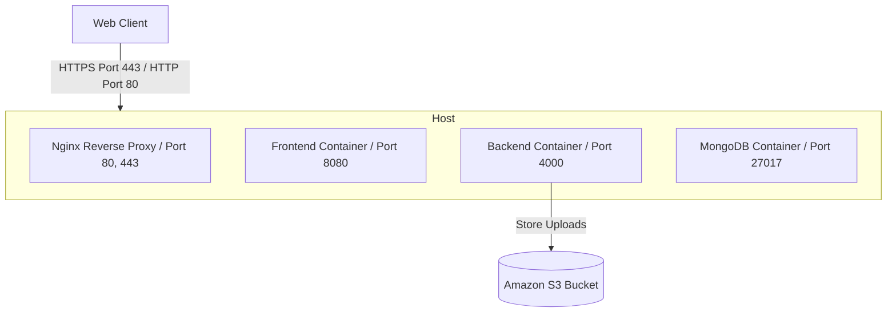

# MediVault — v2.0 Production Deployment & Pipeline Guide

This guide outlines the steps to containerize, test, and deploy MediVault to production. It contains the current configuration status, deployment logs, local verification guides, and a highly detailed AWS EC2 deployment guide using standard `docker run` and `docker-compose` commands (Option 2).

---

## 📋 v2.0 Deployment Status Log

### ✅ What is DONE
1. **Frontend Env Config**: Configured `axiosClient.js` and `patientApi.js` to utilize `import.meta.env.VITE_API_URL` dynamically.
2. **Hardcoded URLs Removed**: Replaced all instances of hardcoded `http://localhost:4000` URLs across all React pages (`Login.jsx`, `PrescriptionForm.jsx`, `PatientPrescriptions.jsx`, `DoctorDashboard.jsx`, etc.).
3. **Frontend Env File**: Created local development `.env` containing `VITE_API_URL` for Vite.
4. **Backend CORS Env Config**: Configured `server.js` to dynamically read frontend domain from `process.env.FRONTEND_URL` with a local fallback.
5. **AWS ALB / Docker Healthcheck**: Added `/health` route to the Express API to allow load balancers and container runtimes to check service status.
6. **AWS S3 File Storage Integration**: Configured `fileRoutes.js` and backend `package.json` to upload files to AWS S3 using `@aws-sdk/client-s3` dynamically if `S3_BUCKET_NAME` is defined, with a local multer fallback for development.
7. **Monorepo Dockerignore**: Created a root `.dockerignore` file to optimize docker builds.
8. **Local Docker Compose**: Configured multi-container orchestration with MongoDB, Backend, and Frontend for rapid local verification.
9. **Frontend Production Nginx**: Created `nginx.conf` and updated the frontend `Dockerfile` to accept the backend URL as a build argument.

### ⏳ What is LEFT to Run
1. **Local Docker Compose Verification**: Run `docker-compose up -d --build` once Docker Desktop is running locally to verify full orchestration.
2. **AWS Option 2 (EC2 Single/Multi Container) Setup**: Provision an AWS EC2 instance, install Docker, and launch using individual `docker run` commands or production `docker-compose`.
3. **GitHub Actions Workflow Execution**: Place the pipeline configuration inside `.github/workflows/deploy.yml` to automate pushes to the target instance.

---

## 1. Containerization & Local Compose Verification

### 1.1 Backend Dockerfile (Node.js + Python Subprocess Support)
Save as `apps/backend/Dockerfile`. It uses a Debian-based slim image to easily install python3, build dependencies, and dependencies for the Python RAG service.

```dockerfile
FROM node:20-bullseye-slim

# Install system dependencies, including Python 3, pip, and compilation tools
RUN apt-get update && apt-get install -y \
    python3 \
    python3-pip \
    python3-dev \
    build-essential \
    && rm -rf /var/lib/apt/lists/*

WORKDIR /app

# Copy root package files and backend workspace package files
COPY package*.json ./
COPY apps/backend/package*.json ./apps/backend/

# Install Node dependencies using npm workspaces (production only)
RUN npm ci --omit=dev --workspace=apps/backend

# Copy requirements.txt for Python RAG service
COPY apps/rag-service/requirements.txt ./apps/rag-service/
# Install Python dependencies globally
RUN pip3 install --no-cache-dir -r apps/rag-service/requirements.txt

# Copy source code (maintaining the directory structure for relative imports)
COPY apps/backend/src/ ./apps/backend/src/
COPY apps/backend/scripts/ ./apps/backend/scripts/
COPY apps/backend/migrations/ ./apps/backend/migrations/
COPY apps/rag-service/ ./apps/rag-service/

# Set working directory to the backend application
WORKDIR /app/apps/backend

# Expose HTTP port
EXPOSE 4000

# Set running environment variables defaults
ENV PORT=4000 \
    NODE_ENV=production \
    PYTHON_PATH=python3

# Run the backend server
CMD ["node", "src/server.js"]
```

### 1.2 Frontend Dockerfile (Multi-stage Build & Nginx)
Save as `apps/frontend/Dockerfile`. It compiles the Vite frontend and configures Nginx to serve the build output with proper SPA routing.

```dockerfile
# Stage 1: Build static assets
FROM node:20-alpine AS builder
WORKDIR /app

# Accept VITE_API_URL as a build argument so the correct backend URL is baked in at build time
ARG VITE_API_URL=http://localhost:4000
ENV VITE_API_URL=$VITE_API_URL

# Copy workspaces configurations
COPY package*.json ./
COPY apps/frontend/package*.json ./apps/frontend/

# Install dependencies (only for frontend workspace)
RUN npm ci --workspace=apps/frontend

# Copy frontend source code
COPY apps/frontend/ ./apps/frontend/

# Build Vite application (creates apps/frontend/dist)
RUN npm run build --workspace=apps/frontend

# Stage 2: Serve with Nginx
FROM nginx:1.25-alpine

# Copy Nginx SPA configuration
COPY apps/frontend/nginx.conf /etc/nginx/conf.d/default.conf

# Copy built assets from Stage 1
COPY --from=builder /app/apps/frontend/dist /usr/share/nginx/html

EXPOSE 80
CMD ["nginx", "-g", "daemon off;"]
```

### 1.3 Running Local Compose
Verify the full containerized stack locally by launching the following command from the root directory:
```powershell
# Start the orchestration in the background
docker-compose up -d --build

# Verify all services are healthy and running
docker-compose ps
```

---

## 2. AWS Production Deployment: Option 2 (EC2 Deployment via Docker Run Commands)

This option deploys MediVault directly to a production AWS EC2 Instance using standard, sequential docker CLI commands.



### Step 1: Initialize AWS Resources
1. **Launch EC2 Instance**:
   - Provision an `t3.medium` (or larger) instance running Ubuntu Server.
   - Configure Security Groups to allow incoming traffic on port `80` (HTTP), `443` (HTTPS), and `22` (SSH).
2. **AWS S3 Bucket**: Create an S3 bucket named `medivault-uploads-prod`. Add an IAM role to the EC2 instance allowing read/write permission to this bucket.

### Step 2: Install Docker on EC2
SSH into the EC2 instance and run:
```bash
# Update package list and install docker
sudo apt-get update
sudo apt-get install -y docker.io docker-compose

# Start and enable Docker service
sudo systemctl start docker
sudo systemctl enable docker

# Add user to docker group
sudo usermod -aG docker ubuntu
```

### Step 3: Run the MongoDB Container
```bash
# Create persistent directory for database storage
mkdir -p ~/mongo-data

# Run MongoDB container
docker run -d \
  --name mongodb \
  --restart always \
  -p 27017:27017 \
  -v ~/mongo-data:/data/db \
  mongo:6-jammy
```

### Step 4: Build and Run the Backend Container
Build the backend image from the monorepo root:
```bash
# Build the backend image
docker build -f apps/backend/Dockerfile -t medivault-backend:latest .

# Run the backend service container, linking to mongodb container
docker run -d \
  --name medivault-backend \
  --restart always \
  -p 4000:4000 \
  --link mongodb:mongodb \
  -e NODE_ENV=production \
  -e DATA_STORE=mongo \
  -e MONGO_URI=mongodb://mongodb:27017/medivault \
  -e MONGO_DB_NAME=medivault \
  -e S3_BUCKET_NAME=medivault-uploads-prod \
  -e AWS_REGION=us-east-1 \
  -e FRONTEND_URL=https://medivault.yourdomain.com \
  -e JWT_SECRET=your_production_jwt_secret_key_here \
  -e PRIVATE_KEY=0x_your_blockchain_private_key_here \
  -e CONTRACT_ADDRESS=0x_your_contract_address_here \
  -e SEPOLIA_RPC_URL=https://sepolia.infura.io/v3/your_project_id \
  -e GROQ_API_KEY=your_groq_api_key_here \
  medivault-backend:latest
```

### Step 5: Build and Run the Frontend Container
Build the frontend image, embedding your public API domain name:
```bash
# Build the frontend image, passing target API URL argument
docker build -f apps/frontend/Dockerfile \
  --build-arg VITE_API_URL=https://api.medivault.yourdomain.com \
  -t medivault-frontend:latest .

# Run the frontend service container
docker run -d \
  --name medivault-frontend \
  --restart always \
  -p 8080:80 \
  medivault-frontend:latest
```

### Step 6: Setup Reverse Proxy & Let's Encrypt (Nginx on Host)
Install Nginx natively on the host machine to handle SSL termination and route traffic:
```bash
sudo apt-get install -y nginx certbot python3-certbot-nginx
```

Configure Nginx site configuration (`/etc/nginx/sites-available/medivault`):
```nginx
server {
    listen 80;
    server_name medivault.yourdomain.com api.medivault.yourdomain.com;

    location / {
        if ($host = "api.medivault.yourdomain.com") {
            proxy_pass http://127.0.0.1:4000;
        }
        if ($host = "medivault.yourdomain.com") {
            proxy_pass http://127.0.0.1:8080;
        }
        proxy_set_header Host $host;
        proxy_set_header X-Real-IP $remote_addr;
        proxy_set_header X-Forwarded-For $proxy_add_x_forwarded_for;
        proxy_set_header X-Forwarded-Proto $scheme;
    }
}
```

Enable configuration and generate SSL Certificates:
```bash
sudo ln -s /etc/nginx/sites-available/medivault /etc/nginx/sites-enabled/
sudo systemctl restart nginx

# Obtain free SSL certificates automatically
sudo certbot --nginx -d medivault.yourdomain.com -d api.medivault.yourdomain.com
```

---

## 3. CI/CD Deployment Pipeline Configuration

Save the workflow as `.github/workflows/deploy.yml` to automate testing, building, and deployment to the EC2 target instance on push to the `main` branch.

```yaml
name: MediVault Production Deploy Pipeline

on:
  push:
    branches: [ main ]

jobs:
  test:
    name: Run Tests
    runs-on: ubuntu-latest
    steps:
      - name: Checkout Code
        uses: actions/checkout@v4

      - name: Setup Node
        uses: actions/setup-node@v4
        with:
          node-version: 20
          cache: 'npm'

      - name: Install dependencies
        run: npm ci

      # Execute tests (Backend and Frontend)
      # - name: Run Backend Unit Tests
      #   run: npm test --workspace=apps/backend

  deploy:
    name: Deploy to EC2
    needs: test
    runs-on: ubuntu-latest
    steps:
      - name: Deploy via SSH
        uses: appleboy/ssh-action@master
        with:
          host: ${{ secrets.EC2_HOST }}
          username: ubuntu
          key: ${{ secrets.EC2_SSH_KEY }}
          script: |
            cd ~/my-react-app
            git pull origin main
            
            # Rebuild and run using compose
            docker-compose -f docker-compose.yml up -d --build
```
